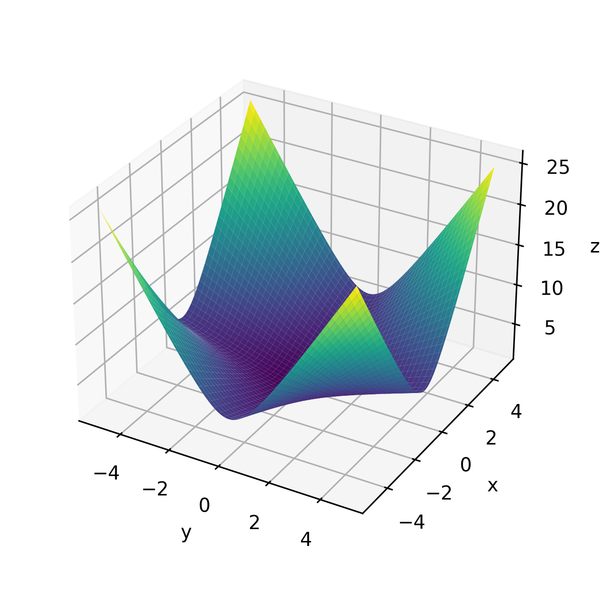

# Trabajo Práctico 1 | Análisis Matemático II

Representación gráfica de superficies y curvas de nivel con ayuda de computadora. Estudio de continuidad.

## Ejercicio 19

$$
f \left( x, y \right) =
\left[ \left( x^2 + 1 \right) \cdot \left( y^2 + 1 \right) \right]^{\frac{1}{2}} =
\sqrt{\left( x^2 + 1 \right)\left( y^2 + 1 \right)}
$$

1. Representar superficie y curvas de nivel correspondientes a la función $z = f(x, y)$ en el recinto $-5 \leq x \leq 5,\ -5 \leq y \leq 5$.
2. Realizar un estudio de continuidad de la función en el recinto dado.

La función $f(x, y)$ está definida como la raíz cuadrada de un producto de expresiones cuadráticas con término constante positivo. Observamos que $x^2 + 1 > 0$ y $y^2 + 1 > 0$ para todo $\left( x, y \right) \in \mathbb{R}^2$, por lo tanto el radicando $(x^2 + 1)(y^2 + 1)$ es estrictamente positivo para todo $(x, y)$.

Como la raíz cuadrada está aplicada a una función estrictamente positiva y compuesta por operaciones continuas (suma, multiplicación, raíz cuadrada), concluimos que $f(x, y)$ es continua en todo $\mathbb{R}^2$, y en particular, es continua en el recinto $[-5, 5] \times [-5, 5]$.
